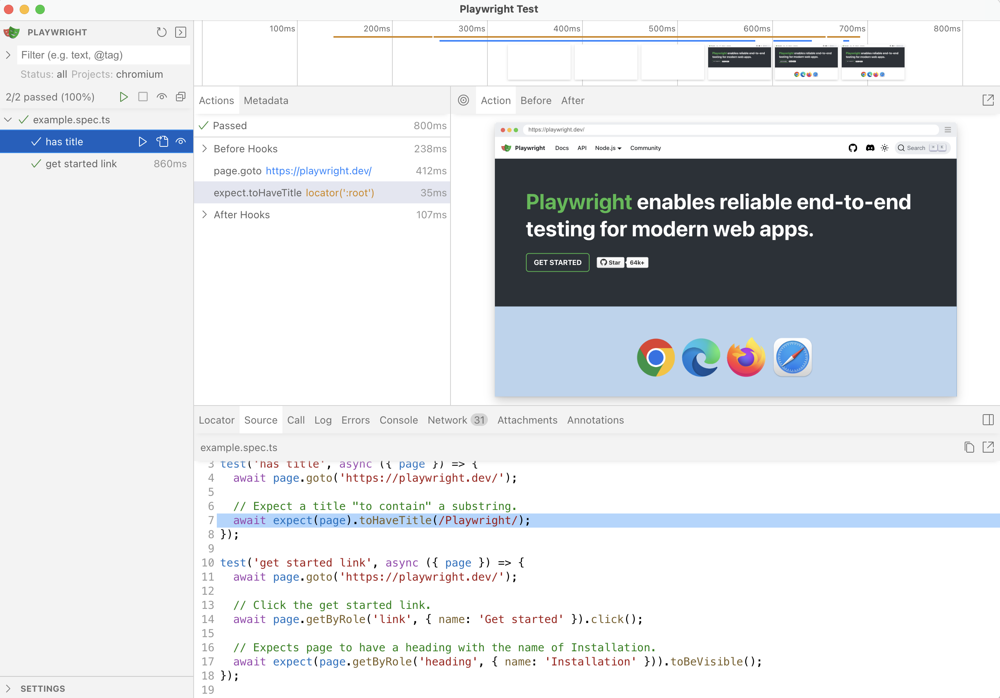
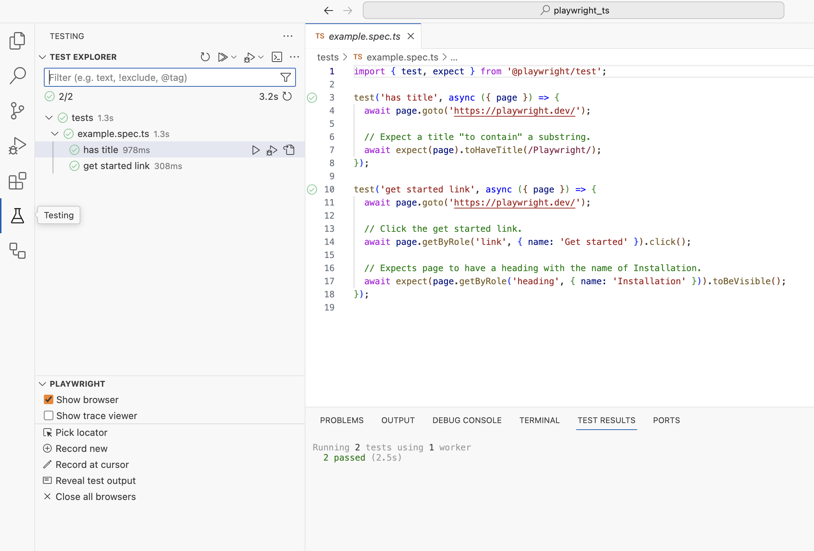
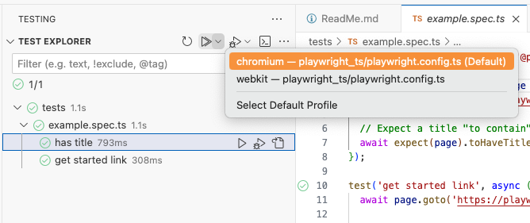
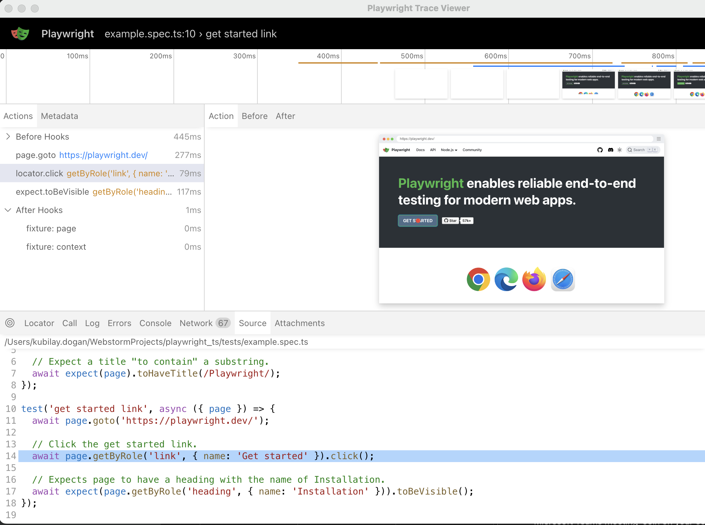
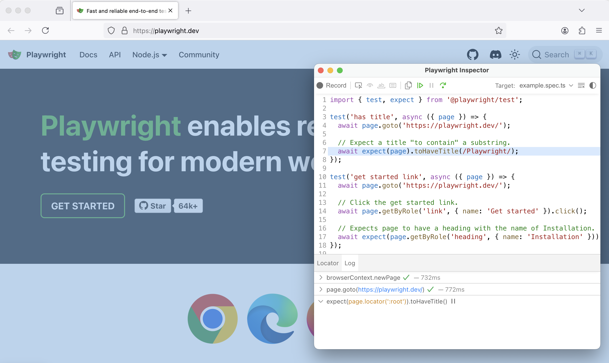
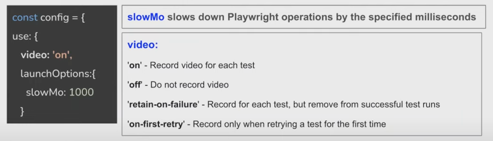

# Playwright Guide - TypeScript

Playwright is a framework for end-to-end testing of web applications using Node.js.


<details>
  <summary><strong><span style="color:blue">Getting started</span></strong></summary>
  
  ---
  ### [Getting started]()
  
  #### Option 1
  - Run command: `npm init playwright@latest`

  #### Option 2
  - Install `Playwright Test for VS Code` extension
  - Once installed, open the command panel and type: `>Install Playwright`
  - Select the browsers you would like to run your tests on

  <br>

  ---
  <br>

</details>

<details>
  <summary><strong><span style="color:blue">How to configure browsers</span></strong></summary>
  
  ---
  ### [How to configure browsers]()
  * By default tests will be run on all 3 browsers:
    - chromium
    - firefox
    - webkit

* Browsers can be configured in the **playwright.config.ts** file.

  ```ts
  projects: [
    {
      name: 'chromium',
      use: { ...devices['Desktop Chrome'] },
    },
    {
      name: 'firefox',
      use: { ...devices['Desktop Firefox'] },
    },

    {
      name: 'webkit',
      use: { ...devices['Desktop Safari'] },
    },
  ],
  ```
  
  You can set browser-specific options, and customize the launch settings.

  ```ts
  {
    name: 'Chromium',
    use: {
      browserName: 'chromium',
      headless: false,    // Run tests in headful mode
      viewport: { width: 1280, height: 720 },
    },
  },
  ```

  <br>
  
  ---
  <br>
  
</details>


<h2 style="color:white; background-color:black; padding: 10px;"> Running Tests 🏃</h2>

```node
npx playwright test
npx playwright test --project=chromium
```

> Check package.json for various run commands

## Running tests based on `tag`

Run tests with specific tag
  ```bash
  playwright test --grep @login
  ```

Skip tests with certain tag:
  ```bash
  playwright test --grep-invert @login
  ```

## Running tests in `headless` / `headful` mode

* Tests are running in headless mode by default.
* To run tests in headful mode:  

  ```bash
  playwright test --headed
  ```

## Running tests in `UI mode`

> playwright test --ui

`--ui`: This flag launches the Playwright Test Runner in UI mode. This can be particularly useful for **debugging** and **visualizing test results**.

</img>

## Run Tests and Show Browsers

</img>

You can also run your tests and show the browsers by selecting the option `Show Browsers` in the testing sidebar.
Uncheck it if you prefer your tests to run in **headless mode**

## Run Tests on Specific Browsers

</img>

The listed profiles are read from the `playwright.config` file

## Run tests with [Trace Viewer](https://playwright.dev/docs/trace-viewer)

Running tests with the `Show Trace Viewer` option and step through each action of your tests. 
**Source Code**

</img>

## Running tests in `debug mode`

> playwright test --debug

</img>


  <br>
  
  ---
  <br>

</details>

## Reporters

Playwright provides several built-in reporters to help you format and view your test results in different way

1. **List Reporter (`list`)**:
   - Displays a detailed list of all tests, including their status and duration.
   - Useful for getting a comprehensive view of all test results.

2. **Dot Reporter (`dot`)**:
   - Displays a dot for each test, with different colors representing different statuses (passed, failed, etc.).
   - Useful for a quick, visual overview of test results.

3. **Line Reporter (`line`)**:
   - Displays each test result on a single line.
   - Useful for a concise summary of test results.

4. **JSON Reporter (`json`)**:
   - Outputs test results in JSON format.
   - Useful for integrating with other tools or for further processing.

5. **JUnit Reporter (`junit`)**:
   - Outputs test results in JUnit XML format.
   - Useful for integrating with CI/CD systems that support JUnit reports.

6. **HTML Reporter (`html`)**:
   - Generates an HTML report with detailed information about each test.
   - Useful for sharing test results with stakeholders.

7. **Allure Reporter (`allure`)**:
   - Generates an Allure report.
   - Useful for detailed test reporting and analysis.

### Example Usage
You can specify a reporter when running your tests using the `--reporter` flag. For example:
```bash
npx playwright test --reporter=list
```

### Configuration in `playwright.config.js`
You can also configure the reporter in your `playwright.config.js` file:
```javascript
module.exports = {
  reporter: 'list',
};
```

### Multiple Reporters
You can use multiple reporters by specifying them in an array:
```javascript
module.exports = {
  reporter: [
    ['list'],
    ['json', { outputFile: 'results.json' }],
    ['html', { outputFolder: 'html-report' }],
  ],
};
```

This flexibility allows you to tailor the reporting to your specific needs, whether you need detailed reports for debugging or concise summaries for quick checks.

## How to record video and run tests in Slow Motion (decrease speed of the test execution)

</img>

> The video record can be found in the html report

<br>

## `Key Options` in playwright.config.ts file

The **playwright.config.ts** file is used to configure various options for Playwright tests.

1. **`testDir`**: Specifies the directory where your test files are located.
2. **`timeout`**: Sets the maximum time one test can run before timing out.
3. **`fullyParallel`**: If set to `true`, runs tests in files in parallel.
4. **`reporter`**: Specifies the reporter to use for test results. Common options include `'list'`, `'dot'`, `'json'`, etc.
5. **[`use`](command:_github.copilot.openSymbolFromReferences?%5B%22use%22%2C%5B%7B%22uri%22%3A%7B%22%24mid%22%3A1%2C%22fsPath%22%3A%22%2FUsers%2Fkubilaydogan%2FDesktop%2FPlaywright-TS%2Fplaywright.config.ts%22%2C%22external%22%3A%22file%3A%2F%2F%2FUsers%2Fkubilaydogan%2FDesktop%2FPlaywright-TS%2Fplaywright.config.ts%22%2C%22path%22%3A%22%2FUsers%2Fkubilaydogan%2FDesktop%2FPlaywright-TS%2Fplaywright.config.ts%22%2C%22scheme%22%3A%22file%22%7D%2C%22pos%22%3A%7B%22line%22%3A37%2C%22character%22%3A6%7D%7D%5D%5D "Go to definition")**: Contains shared settings for all projects, such as `baseURL` and `trace`.
6. **[`projects`](command:_github.copilot.openSymbolFromReferences?%5B%22projects%22%2C%5B%7B%22uri%22%3A%7B%22%24mid%22%3A1%2C%22fsPath%22%3A%22%2FUsers%2Fkubilaydogan%2FDesktop%2FPlaywright-TS%2Fplaywright.config.ts%22%2C%22external%22%3A%22file%3A%2F%2F%2FUsers%2Fkubilaydogan%2FDesktop%2FPlaywright-TS%2Fplaywright.config.ts%22%2C%22path%22%3A%22%2FUsers%2Fkubilaydogan%2FDesktop%2FPlaywright-TS%2Fplaywright.config.ts%22%2C%22scheme%22%3A%22file%22%7D%2C%22pos%22%3A%7B%22line%22%3A34%2C%22character%22%3A2%7D%7D%5D%5D "Go to definition")**: Defines different projects to run tests against various browsers and devices. Each project can have its own settings.
7. **`retries`**: Configures the number of retries for flaky tests.
8. **`testMatch`**: Specifies the pattern to match test files.
9. **`outputDir`**: Sets the directory where test results will be stored.
10. **`globalSetup` and `globalTeardown`**: Paths to global setup and teardown scripts.

Sample:
```typescript
import { PlaywrightTestConfig, devices } from '@playwright/test';

const config: PlaywrightTestConfig = {
  testDir: './tests',
  timeout: 30000,
  fullyParallel: true,
  reporter: 'list',
  // Shared settings for all projects
  use: {
    baseURL: 'http://localhost:3000',
    trace: 'on-first-retry',
  },
  projects: [
    {
      name: 'chromium',
      use: { ...devices['Desktop Chrome'] },
    }
  ],
  retries: 2,
  testMatch: '**/*.spec.ts',
  outputDir: 'test-results/',

  // Configure global setup and teardown
  globalSetup: require.resolve('./global-setup'),
  globalTeardown: require.resolve('./global-teardown'),
};

export default config;
```